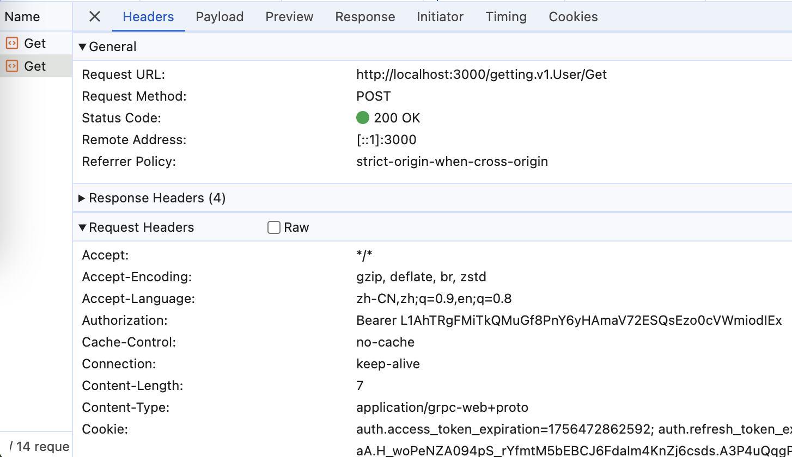

# 在 Next.js 中整合 gRPC 和 gRPC-WEB：构建高效的全栈应用

本文将介绍如何在 Next.js 应用中结合 Tonic 框架，实现 gRPC 和 gRPC-WEB 的无缝集成。我们将详细介绍如何在服务端组件和 API 路由中使用 gRPC 与后端微服务通信，以及如何在客户端组件中利用 gRPC-WEB 直接与后端服务交互。这种方法充分发挥了 Next.js 的服务端渲染能力和 gRPC 的高性能特性，同时保证了前后端的一致性和开发效率。

对于 gRPC 和 gRPC-WEB 的介绍，可以参考 [gRPC 官方文档](https://grpc.io/docs/) 和 [gRPC-WEB 官方文档](https://grpc.io/docs/web/)。

## Next.js

Next.js 是一个基于 React 的开源 JavaScript 框架，由 Vercel 公司开发维护。它为开发者提供了构建高性能、可扩展的 WEB 应用的强大工具和优化策略。

### Next.js 的核心特性

1. **服务器端渲染 (SSR)**：Next.js 默认支持服务器端渲染，可以显著提高首屏加载速度和搜索引擎优化 (SEO) 效果。
2. **静态站点生成 (SSG)**：支持在构建时生成静态 HTML 页面，适用于内容不经常变化的网站。
3. **文件系统路由**：基于文件系统的直观路由方式，简化了路由配置过程。
4. **API 路由**：允许开发者在同一项目中创建 API 端点，便于前后端集成。
5. **自动代码分割**：智能地将代码分割成小块，优化加载性能。
6. **内置 CSS 支持**：支持 CSS Modules、Sass 等多种样式解决方案。
7. **快速刷新**：提供近乎即时的开发体验，支持组件级别的热重载。
8. **图像优化**：内置的 Image 组件自动优化图像加载和显示。
9. **国际化支持**：简化了多语言网站的开发流程。
10. **零配置**：提供开箱即用的开发体验，无需复杂的配置。

Next.js 的这些特性使其成为构建现代 WEB 应用的理想选择，特别适合需要兼顾性能、可扩展性和开发效率的项目。接下来让我们创建一个 Next.js 项目，并添加 gRPC 依赖。使用下面的命令创建 Next.js 项目。

```sh
pnpm dlx create-next-app@latest nextjs-getting
```

除 `Would you like to customize the default import alias (@/*)?*` 选择 `No`，其它都选择 `Yes`。

> 也许你还没有安装 `pnpm`，可以参考 [pnpm 安装文档](https://pnpm.io/zh/installation) 或直接 `npm install -g pnpm` 进行安装。

进入 `nextjs-getting` 目录，使用 `pnpm dev` 启动项目，在浏览器中访问 `http://localhost:3000`，可以看到 Next.js 的默认首页（使用 pnpm 初始化项目时已经安装了相关依赖）。

## 使用 nice-grpc

[nice-grpc](https://github.com/deeplay-io/nice-grpc) 是一个对用户友好的 gRPC 框架，支持 node.js 和浏览器环境（使用 grpc-web）运行。

- 使用 Typescript 编写
- 提供了 Promise 和 Async Iterables 进行流式传输的现代 API
- 支持使用 [`AbortSignal`](https://developer.mozilla.org/en-US/docs/WEB/API/AbortSignal) 取消正在进行的传播
- 通过使用同步生成器的简洁应用程序接口支持客户端和服务器中间件

## 使用服务端组件访问 gRPC 微服务

添加以下依赖到项目中：

```sh
pnpm add nice-grpc protobufjs long
pnpm add -D grpc-tools ts-proto
```

继续使用之前 [`tonic-getting`](https://github.com/yangbajing/grpc-microservices-with-rust/tree/main/tonic-getting) 项目中的 `proto` 文件，复制 `tonic-getting` 项目的 `proto` 目录到 `nextjs-getting` 项目根目录中。然后创建 `generate-proto.sh` 生成脚本，内容如下：

```sh
PROTO_DIR="./proto"
OUT_DIR="./src/pb"

# 创建输出目录
mkdir -p $OUT_DIR

protoc \
    --plugin=./node_modules/.bin/protoc-gen-ts_proto \
    --ts_proto_out=${OUT_DIR} \
    --ts_proto_opt=outputServices=nice-grpc,outputServices=generic-definitions,useExactTypes=false \
    -I ${PROTO_DIR} \
    ${PROTO_DIR}/getting/*.proto \
    ${PROTO_DIR}/getting/common/*.proto \
    ${PROTO_DIR}/getting/v1/*.proto
```

> Windows 下执行脚本在代码仓库可以找到。

运行 `./generate-proto.sh` 生成 TypeScript 代码，代码将输出到 `./src/pb` 目录中。后续若 proto 文件有更新，只需再次运行脚本即可。

### 创建 gRPC 客户端

创建 gRPC 客户端前，先启动后端服务（代码见：[tonic-getting](https://github.com/yangbajing/grpc-microservices-with-rust/tree/main/tonic-getting)）。使用 `cargo run` 启动 `tonic-getting` 项目中的后端服务。

#### src/lib/grpc.ts

创建 grpc 客户端，新建 `src/lib/grpc.ts` 文件，输入以下代码：

```typescript
import { createChannel, createClient } from "nice-grpc";
import { AuthClient, AuthDefinition } from "@/pb/getting/v1/auth";

export const channel = createChannel("localhost:9999");
export const authClient: AuthClient = createClient(AuthDefinition, channel);
```

#### src/actions/sign.ts

创建用于 Next.js 服务端组件的 Action 函数，新建 `src/actions/sign.ts` 文件，输入以下代码：

```typescript
"use server";
import { SigninResponse, TokenType } from "@/pb/getting/v1/auth";
import { authClient } from "@/lib/grpc";

export async function signin(formData: FormData) {
  const email = formData.get("email") as string;
  const password = formData.get("password") as string;

  const request = { email, password };
  try {
    const response: SigninResponse = await authClient.signin(request);

    console.log("登录成功:", response);
    console.log("令牌类型:", TokenType[response.tokenType]);
  } catch (error) {
    console.error("登录失败:", error);
  }
}
```

这里我们使用了 React 服务端组件的 form action 功能。这种方式有以下几个优势:

1. **简化状态管理**: 不需要在客户端维护表单状态，减少了客户端代码的复杂性。
2. **提高性能**: 表单提交直接在服务器端处理，减少了客户端-服务器之间的往返通信。
3. **增强安全性**: 敏感操作(如登录)在服务器端进行，可以更好地保护用户数据。
4. **改善用户体验**: 即使在 JavaScript 禁用的情况下，表单仍然可以正常工作。
5. **无缝集成服务端逻辑**: 可以直接在服务端组件中处理表单提交，方便与后端服务(如 gRPC)集成。

#### src/app/signin/page.tsx

创建登录页面，新建 `src/app/signin/page.tsx` 文件，输入以下代码：

```typescript
// ...
import { signin } from "@/actions/sign";

export default function Signin() {
  return (
    <div className="w-full h-full">
      <form action={signin} className="w-80 mx-auto mt-20 block justify-center items-center space-y-4">
        <div>
          <Label htmlFor="email">邮箱</Label>
          <Input type="email" id="email" name="email" />
        </div>
        <div>
          <Label htmlFor="password">密码</Label>
          <Input type="password" id="password" name="password" />
        </div>
        <div>
          <Button type="submit">登录</Button>
        </div>
      </form>
    </div>
  );
}
```

*使用了 shadcn UI 库，完整代码见：[yangbajing/grpc-microservices-with-rust/blob/main/nextjs-getting/src/app/signin/page.tsx](https://github.com/yangbajing/grpc-microservices-with-rust/blob/main/nextjs-getting/src/app/signin/page.tsx)*

打开浏览器，访问 `http://localhost:3000/signin`，可以看到登录页面。输入邮箱、密码，点击登录按钮，可以在终端看到登录成功的信息（next.js），以及在 gRPC 后端服务中看到登录日志打印。

Next.js 终端输出：

```sh
登录成功: {
  accessToken: 'L1AhTRgFMiTkQMuGf8PnY6yHAmaV72ESQsEzo0cVWmiodIEx',
  tokenType: 1
}
令牌类型: TOKEN_TYPE_BEARER
```

## 使用客户端组件访问 gRPC-WEB API

添加 `grpc-web` 依赖：

```sh
pnpm add nice-grpc-web
```

配置 `next.config.js` 文件，添加对 `grpc-web` 地址的 **rewrites** 规则：

```typescript
module.exports = {
  async rewrites() {
    return [
      {
        source: "/getting.v1.:services/:paths*",
        destination: "http://localhost:9999/getting.v1.:services/:paths*",
      },
    ];
  },
};
```

创建 `lib/grpc-web.ts` 文件，添加以下代码：

```typescript
import { Channel, Client, ClientFactory, createChannel, createClientFactory, Metadata } from "nice-grpc-web";
import { UserDefinition } from "@/pb/getting/v1/user";

const clientFactory: ClientFactory = createClientFactory().use((call, options) => {
  const token = "L1AhTRgFMiTkQMuGf8PnY6yHAmaV72ESQsEzo0cVWmiodIEx";
  return call.next(call.request, {
    ...options,
    metadata: Metadata(options.metadata).set("Authorization", `Bearer ${token}`),
  });
});

export const channel: Channel = createChannel("");
export const userClient: Client<UserDefinition> = clientFactory.create(UserDefinition, channel);
```

这里从 `nice-grpc-web` 导入 `Channel`、`Client`、……`Metadata` 类型和函数，创建 `clientFactory` 和 `channel`，然后使用 `clientFactory.create` 方法创建 `userClient`。

在 `clientFactory` 中，我们创建一个 `Metadata` 对象，并设置 `Authorization` HTTP 头，值为 `Bearer` 加上从后端服务获取的令牌。这样在每次调用 gRPC-WEB API 时，都会自动添加令牌。

在使用 `clientChannel` 时，我们将其设置为空字符串，这样它将使用从浏览器中获取的 URL 地址。gRPC-WEB 在访问后端 API 时，会应用 `rewrites` 规则 `/getting.v1.User/Get` ，并由 Next.js 服务将请求代理到后端 `http://localhost:9999/getting.v1.User/Get` 地址。



打开 chrome 控制台点击 `Network` 标签查看 `getting.v1.User/Get` 请求。期 `Content-Type` 为 `application/grpc-web+proto`，也正确的设置了 `Authorization` 为 `Bearer` 类型。

## 小结

本文介绍了如何在 Next.js 应用中集成 gRPC 和 gRPC-WEB，实现了高效的全栈应用架构。通过这种集成，我们充分利用了 Next.js 的服务端渲染能力和 gRPC 的高性能特性，同时保证了前后端的一致性和开发效率。

### 技术栈的优势

1. **性能优化**：gRPC 的高效二进制传输协议和 Next.js 的服务端渲染结合，大大提升了应用的性能。
2. **开发效率**：使用 `nice-grpc` 和 `nice-grpc-web` 简化了 gRPC 的使用，提高了开发效率。
3. **类型安全**：通过 `protobuf` 生成的 `TypeScript` 代码，确保了前后端接口的类型一致性。
4. **灵活性**：Next.js 的服务端组件和客户端组件分别使用 gRPC 和 gRPC-WEB，提供了更灵活的架构选择。

#### BFF（Backends For Frontends）

BFF（Backends For Frontends）是一种先进的 Web 架构模式，最初由 Sam Newman 在其文章 [Pattern: Backend for Frontends](https://samnewman.io/patterns/architectural/bff/) 中提出。这种架构通过在前端和后端之间引入一个专门的中间层，有效地优化了前后端分离，显著提升了开发效率和系统性能。

在现代 Web 开发中，Next.js（以及类似的 Nuxt.js）等框架凭借其强大的服务端渲染（SSR）和静态站点生成（SSG）能力，为 BFF 的实现提供了理想的技术基础。这些框架内置的服务端功能，如 API 路由和服务端组件，为与后端服务的无缝集成开辟了新的可能性。相比传统的 BFF 实现方式（如使用 Spring Gateway 或 Nginx 反向代理进行 API 聚合），Next.js 的服务端特性为 BFF 架构提供了更为自然和高效的解决方案。

这种架构模式为后端开发带来了显著优势，使其能够更加专注于核心业务逻辑的实现。BFF 层有效地隔离了前端展示需求和多端适配的复杂性，简化了后端服务的设计。同时，对前端开发人员而言，采用 Next.js 实现 BFF 功能赋予了他们更大的数据处理自主权。这不仅提高了前端开发的灵活性，还使得数据获取和处理过程更加高效和可控。

BFF 模式结合 Next.js 等现代框架，代表了 Web 开发的一个重要发展方向，为构建高性能、可维护的大规模 Web 应用提供了强有力的技术支持。

### 局限性

1. **学习曲线**：开发者需要同时掌握 Next.js、gRPC 和 protobuf，可能存在一定的学习成本。
2. **浏览器兼容性**：gRPC-WEB 可能在一些旧版浏览器中不被支持，需要考虑兼容性问题。（*现代浏览器基本都支持，当前这一问题不大*）

### 未来展望和改进方向

1. **自动化工具**：开发更智能的代码生成工具，进一步简化 gRPC 和 Next.js 的集成过程。
2. **性能优化**：探索 gRPC 流式传输在 Next.js 中的应用，以支持更高效的实时数据交互。
3. **安全性增强**：实现更完善的身份认证和授权机制，确保 gRPC 调用的安全性。
4. **监控和日志**：集成专门的 gRPC 监控和日志工具，提高应用的可观测性。
5. **跨平台支持**：探索将此架构扩展到移动应用开发，实现真正的全平台统一接口。

通过本文的实践，我们展示了 Next.js 与 gRPC 的强大组合。这种架构不仅适用于小型项目，也能很好地扩展到大型、复杂的企业级应用。随着技术的不断发展，我们期待看到更多创新的集成方式，进一步提升 WEB 应用的开发体验和运行效率。

### 源码

本文涉及源码在 Github 上：

- Next.js 项目：[https://github.com/yangbajing/grpc-microservices-with-rust/tree/main/nextjs-getting](https://github.com/yangbajing/grpc-microservices-with-rust/tree/main/nextjs-getting)
- gRPC 服务：[https://github.com/yangbajing/grpc-microservices-with-rust/tree/main/tonic-getting](https://github.com/yangbajing/grpc-microservices-with-rust/tree/main/tonic-getting)
